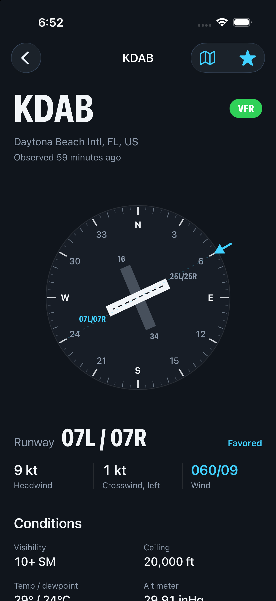
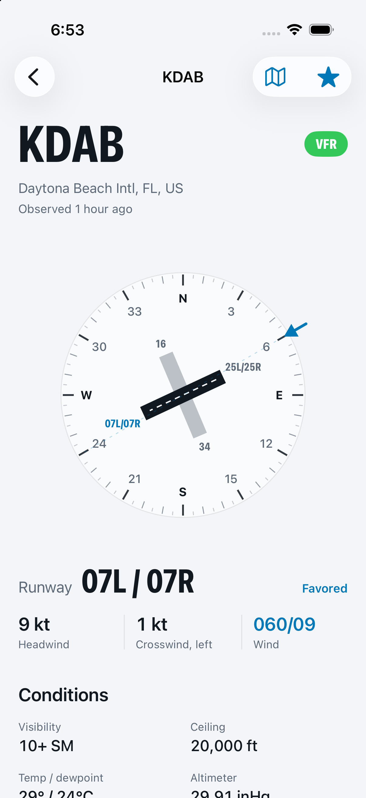
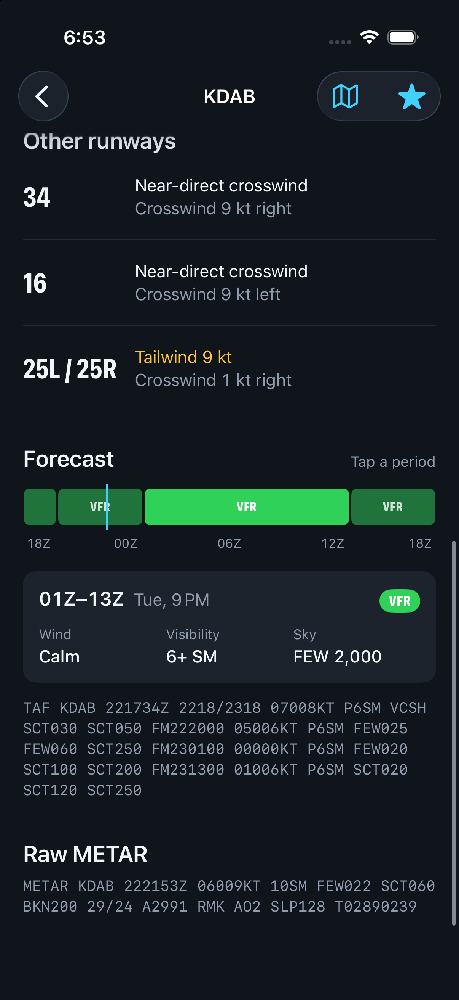
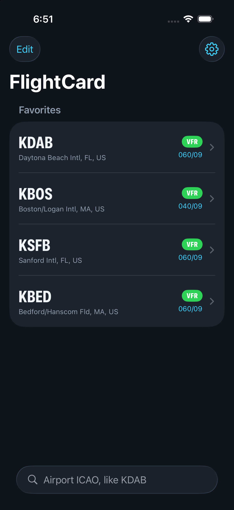
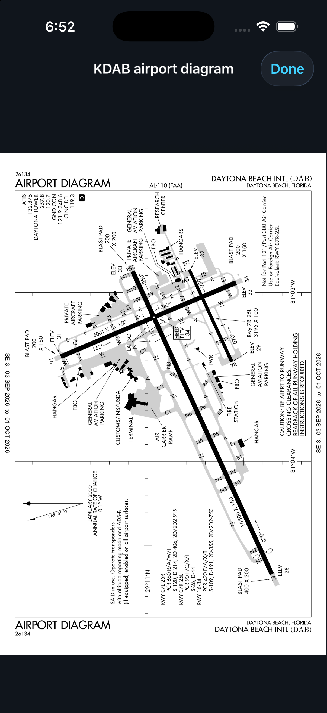

# FlightCard

FlightCard is an iOS app for checking airport weather the way I actually use it before a flight. It shows which runway the wind favors, the headwind and crosswind for every runway (gusts too), the TAF, density altitude, and the FAA airport diagram. SwiftUI, data from the NOAA Aviation Weather Center.

<table>
  <tr>
    <td></td>
    <td></td>
    <td></td>
  </tr>
  <tr>
    <td></td>
    <td></td>
    <td></td>
  </tr>
</table>

## Why

I'm a flight student, and before a flight I always end up reading the METAR and doing the crosswind math in my head. I wanted one screen that just tells me which runway and how much wind, with the raw METAR and TAF still right there so I can double check it.

## Details a pilot would check

- METAR winds are true, but ATIS and tower winds are magnetic. AWC's runway headings are also true, so the crosswind math works without converting anything, and the dial is true north up.
- Headwind and crosswind are figured separately for the steady wind and the gust. Your crosswind limit gets checked against the gust.
- If the headwind is under 2 kt, the app calls it a near-direct crosswind instead of picking a favored runway. The math was right before I added this, but it was telling pilots something misleading.
- Parallel runways within 3° share one label, sorted L/C/R. The data has ORD's 04L and 04R a degree apart, which split them until I fixed it.
- AWC rounds the altimeter to whole hPa, which can be off by 0.01–0.02 inHg, so the app reads the exact number from the raw METAR's `A` group.
- TEMPO groups only list what changes, so they fill in the rest from the main forecast before getting a flight category. They're drawn dashed since they're "might happen."
- If AWC leaves the flight category blank, the app works it out from ceiling and visibility using the FAA definitions, and says so. With no visibility it shows nothing instead of guessing VFR.
- A METAR older than 70 minutes gets flagged as a missed report. A station's last report of the day (`RMK LAST`) gets its own note, since the station is closed, not broken.
- A temp/dewpoint spread of 2°C or less in VFR or MVFR gets a fog caution.

## Features

- Wind dial: HSI-style compass rose, runways at true heading, numbers at the approach end, wind pointer on the bezel, collision-aware labels for busy airports like BOS and ATL
- Favored runway with headwind, crosswind, and gusts
- Personal minimums: set a max crosswind and runways over it are flagged
- TAF timeline on a Zulu axis with a "now" marker and tap-for-details
- Official FAA airport diagrams from the d-TPP, with pinch and double-tap zoom
- Favorites showing live flight category and wind, with reorder and delete
- Light, dark, or system appearance; inHg or hPa

## Engineering

- SwiftUI, Swift concurrency, `@Observable`, iOS 17+
- Decoding built against real AWC responses, handling the messy parts: `visib` as `"10+"` or a number, `wdir` as `"VRB"`, `204` for no data
- Respects AWC's rules: custom User-Agent, response caching to stay under the rate limit
- Runway grouping, wind components, density altitude, TAF decoding, and flight category thresholds live outside the views and are unit tested with Swift Testing (24 tests), including cases for ORD, ATL, BOS, KBED, and KOMN

```
FlightCard/
  Models/     Metar, Taf, Airport
  Services/   AWCClient, DiagramService
  Logic/      WindCalc, DensityAltitude, RunwayGrouping
  Views/      SearchView, AirportCardView, WindDial, TafTimeline, ...
FlightCardTests/
```

## How I built it

I used AI a lot for this. What I did was check everything against what I actually see as a pilot and fix what was wrong. Stuff like the ORD runway labels being backwards and the crosswind wording came from me testing it at real airports, and the logic that matters has tests.

## Data and disclaimer

**Not for navigation.** Weather from the [NOAA Aviation Weather Center](https://aviationweather.gov/data/api/). Airport diagrams from the FAA digital Terminal Procedures Publication.

For situational awareness only. Not a substitute for an official weather briefing.

## License

MIT
